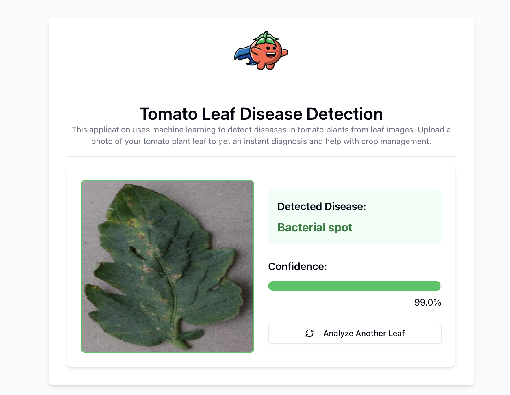

🍅 Tomato Disease Detection

An AI-powered web application that detects tomato plant diseases from leaf images using deep learning and computer vision.

🌍 Problem Statement

Tomato farmers worldwide lose billions in crop yield every year due to plant diseases. Early detection is critical, but traditional diagnosis:

Requires expert knowledge

Is time-consuming

Is not always accessible in rural areas

This creates a major gap between disease onset and intervention, leading to avoidable losses.

💡 Solution

Tomato Disease Detection leverages Deep Learning (CNNs) to provide:

Instant disease diagnosis

High accuracy predictions

Easy-to-use interface for non-experts

All a user needs to do is upload an image of a tomato leaf — the system handles the rest.

✨ Features

📷 Upload tomato leaf images for analysis

⚡ Real-time disease prediction

📊 Confidence score for each prediction

🌿 Detects multiple disease classes

💻 Clean and responsive UI

🧪 Supported Classes

The model currently detects:

Bacterial Spot

Early Blight

Late Blight

Mosaic Virus

Healthy Leaves

🖥️ Demo Flow

Upload a tomato leaf image

Model processes the image

Returns:

Predicted disease

Confidence score

🏗️ System Architecture
Frontend (Next.js + TypeScript)
        │
        ▼
Backend API (FastAPI)
        │
        ▼
Deep Learning Model (TensorFlow/Keras CNN)
🚀 Getting Started
📌 Prerequisites

Make sure you have installed:

Python 3.12+

Node.js 20+

npm or yarn

⚙️ Backend Setup (FastAPI)
cd backend
uv sync
uv run main.py

Backend runs on:

http://localhost:8001
🎨 Frontend Setup (Next.js)
cd frontend
npm install
npm run dev

Frontend runs on:

http://localhost:3000
🧠 Model Training

The model is a Convolutional Neural Network (CNN) trained using:

Framework: TensorFlow (v2.19)

Dataset: PlantVillage (from Kaggle)

Dataset Size: ~7000 images

Key Training Features

Data augmentation for robustness

Multiple lighting conditions

Different angles and leaf orientations

Various disease progression stages

Training notebook:

training/training.ipynb
📊 Technical Stack
Layer	Technology
Frontend	Next.js + TypeScript
Backend	FastAPI
AI Model	TensorFlow / Keras (CNN)
Dataset	PlantVillage Dataset
Package Mgmt	uv, npm
📂 Project Structure
tomato-disease-detection/
│
├── backend/                # FastAPI server
├── frontend/               # Next.js frontend
├── training/               # Model training notebook
├── model/                  # Saved model files
├── README.md
🔍 API Endpoint
POST /predict

Request:

Form-data with image file

Response:

{
  "prediction": "Early Blight",
  "confidence": 0.94
}
🌱 Future Enhancements

🌾 Multi-crop disease detection

📱 Mobile app (offline support)

💊 Treatment & pesticide recommendations

🌦️ Weather-based disease prediction

📡 IoT integration for smart farming

🧠 More advanced models (Vision Transformers)

🤝 Contributing

Contributions are welcome!

Steps:

Fork the repository

Create a new branch

Make your changes

Submit a pull request

You can also open an issue for bugs or feature requests.

📝 License

This project is licensed under the MIT License.

📬 Contact

Ukana Ikpe
📧 Email: ikpeukana964@gmail.com

🌟 Vision

Helping farmers grow healthier crops, one image at a time.